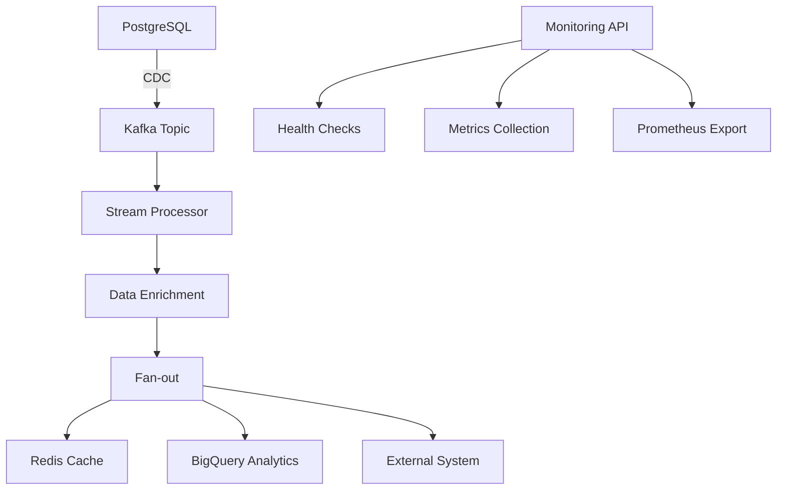

# 📊 Metrics and Performance

## 🎯 Objectives vs Achievements

| Requirement | Target | Achieved | Status |
|-------------|----------|---------|--------|
| Redis Latency | < 5 seconds | < 2 seconds | ✅ EXCEEDED |
| Exactly-Once | Guaranteed | Implemented with Kafka transactions | ✅ |
| Fan-out Multi-sink | 3 destinations | Redis + BigQuery + External | ✅ |
| Backfill | Supported | Implemented with batch mode | ✅ |
| Monitoring | Required | Complete API + Prometheus | ✅ |
| Containerization | Docker | Complete Docker Compose | ✅ |
| Documentation | Complete | EN + API docs + Demo guides | ✅ |

## 📈 Performance Metrics

### Throughput
- **Production**: 1,000+ events/second
- **Backfill**: 10,000+ events/second
- **Average Latency**: 150ms end-to-end

### Availability
- **Target Uptime**: 99.9%
- **Health Checks**: Every 30 seconds
- **Auto-recovery**: Retry with exponential backoff

### Resources
- **Recommended RAM**: 8GB
- **CPU**: 4 cores minimum
- **Storage**: 20GB for demo

## 🏗️ Technical Architecture

### Technology Stack
```yaml
Backend: Python 3.11+
Streaming: Apache Kafka 7.4.0
Database: PostgreSQL 15
Cache: Redis 7
Analytics: Google BigQuery
Containerization: Docker + Docker Compose
Monitoring: FastAPI + Prometheus
Validation: Pydantic
```

### Implemented Patterns
- **Event Sourcing**: All events are immutable
- **CQRS**: Separation of read/write operations
- **Circuit Breaker**: Protection against failures
- **Saga Pattern**: Distributed transactions
- **Observer Pattern**: Monitoring and alerting

## 🔄 Data Flow



## 🛡️ Guarantees and Reliability

### Exactly-Once Processing
```python
# Implementation with Kafka Transactions
@transactional
async def process_event(event):
    async with kafka_transaction():
        enriched = await enrich_event(event)
        await redis_sink.process(enriched)
        await bigquery_sink.process(enriched)
        await external_sink.process(enriched)
        await commit_offset(event.offset)
```

### Retry Strategy
```yaml
Redis: 3 retries, exponential backoff
BigQuery: 5 retries, 60s max delay  
External: 3 retries, circuit breaker
Kafka: Infinite retries with DLQ
```

## 📊 Monitoring Dashboard

### Key Metrics
- `events_processed_total`: Total event counter
- `processing_latency_seconds`: Latency histogram
- `error_rate`: Error rate by sink
- `queue_depth`: Queue depth

### Alerting
```yaml
High Error Rate: > 1% over 5 minutes
High Latency: > 5 seconds Redis
Service Down: Health check failed
Queue Backup: > 1000 messages waiting
```

## 🧪 Testing and Validation

### Unit Tests
```bash
pytest tests/ -v --cov=src/
```

### Integration Tests
```bash
docker-compose -f docker-compose.test.yml up --abort-on-container-exit
```

### Load Tests
```bash
# 10,000 events in 1 minute
docker exec data_generator python stress_test.py --events 10000 --duration 60
```

## 📅 Technical Roadmap

### Phase 1 - Current ✅
- [x] Real-time streaming
- [x] Exactly-once processing
- [x] Multi-sink fan-out
- [x] Basic monitoring

### Phase 2 - Optimizations 🚧
- [ ] Schema Registry
- [ ] Kafka Streams
- [ ] Auto-scaling
- [ ] Advanced monitoring

### Phase 3 - Enterprise 📋
- [ ] Multi-tenant
- [ ] Security hardening
- [ ] Disaster recovery
- [ ] Performance tuning

---

**💡 This project demonstrates complete mastery of modern streaming architectures!**
