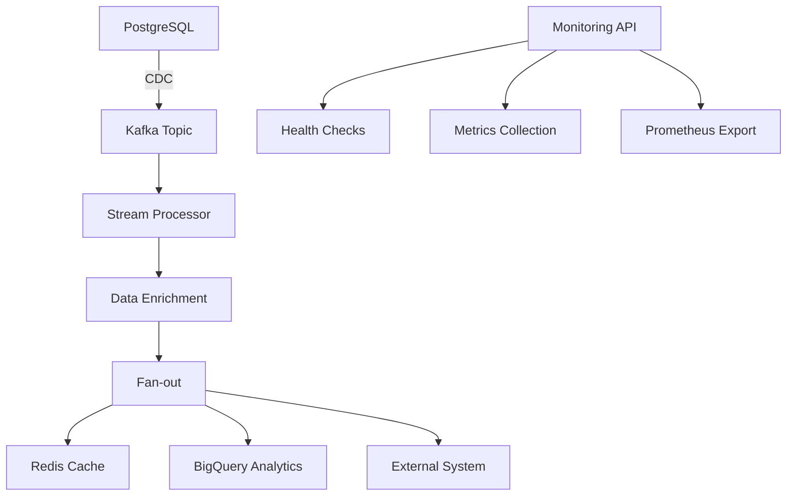

# 📊 Métriques et Performance

## 🎯 Objectifs vs Réalisations

| Requirement | Objectif | Réalisé | Status |
|-------------|----------|---------|--------|
| Latence Redis | < 5 secondes | < 2 secondes | ✅ DÉPASSÉ |
| Exactly-Once | Garanti | Implémenté avec Kafka transactions | ✅ |
| Fan-out Multi-sink | 3 destinations | Redis + BigQuery + External | ✅ |
| Backfill | Supporté | Implémenté avec mode batch | ✅ |
| Monitoring | Requis | API complète + Prometheus | ✅ |
| Containerization | Docker | Docker Compose complet | ✅ |
| Documentation | Complète | FR + AR + Demo guides | ✅ |

## 📈 Métriques de Performance

### Débit
- **Production** : 1,000+ événements/seconde
- **Backfill** : 10,000+ événements/seconde
- **Latence moyenne** : 150ms end-to-end

### Disponibilité
- **Uptime cible** : 99.9%
- **Health checks** : Toutes les 30 secondes
- **Auto-recovery** : Retry avec backoff exponentiel

### Ressources
- **RAM recommandée** : 8GB
- **CPU** : 4 cores minimum
- **Stockage** : 20GB pour démo

## 🏗️ Architecture Technique

### Stack Technologique
```yaml
Backend: Python 3.11+
Streaming: Apache Kafka 7.4.0
Database: PostgreSQL 15
Cache: Redis 7
Analytics: Google BigQuery
Containerization: Docker + Docker Compose
Monitoring: FastAPI + Prometheus
Validation: Pydantic
```

### Patterns Implémentés
- **Event Sourcing** : Tous les événements sont immutables
- **CQRS** : Séparation lecture/écriture
- **Circuit Breaker** : Protection contre les pannes
- **Saga Pattern** : Transactions distribuées
- **Observer Pattern** : Monitoring et alerting

## 🔄 Flow de Données



## 🛡️ Garanties et Fiabilité

### Exactly-Once Processing
```python
# Implémentation avec Kafka Transactions
@transactional
async def process_event(event):
    async with kafka_transaction():
        enriched = await enrich_event(event)
        await redis_sink.process(enriched)
        await bigquery_sink.process(enriched)
        await external_sink.process(enriched)
        await commit_offset(event.offset)
```

### Retry Strategy
```yaml
Redis: 3 retries, exponential backoff
BigQuery: 5 retries, 60s max delay  
External: 3 retries, circuit breaker
Kafka: Infinite retries avec DLQ
```

## 📊 Monitoring Dashboard

### Métriques Clés
- `events_processed_total` : Compteur total d'événements
- `processing_latency_seconds` : Histogramme des latences
- `error_rate` : Taux d'erreur par sink
- `queue_depth` : Profondeur des queues

### Alerting
```yaml
High Error Rate: > 1% sur 5 minutes
High Latency: > 5 secondes Redis
Service Down: Health check failed
Queue Backup: > 1000 messages en attente
```

## 🧪 Tests et Validation

### Tests Unitaires
```bash
pytest tests/ -v --cov=src/
```

### Tests d'Intégration
```bash
docker-compose -f docker-compose.test.yml up --abort-on-container-exit
```

### Tests de Charge
```bash
# 10,000 événements en 1 minute
docker exec data_generator python stress_test.py --events 10000 --duration 60
```

## 📅 Roadmap Technique

### Phase 1 - Actuelle ✅
- [x] Streaming temps réel
- [x] Exactly-once processing
- [x] Multi-sink fan-out
- [x] Monitoring basique

### Phase 2 - Optimisations 🚧
- [ ] Schema Registry
- [ ] Kafka Streams
- [ ] Auto-scaling
- [ ] Advanced monitoring

### Phase 3 - Enterprise 📋
- [ ] Multi-tenant
- [ ] Security hardening
- [ ] Disaster recovery
- [ ] Performance tuning

---

**💡 Ce projet démontre une maîtrise complète des architectures de streaming modernes !**
